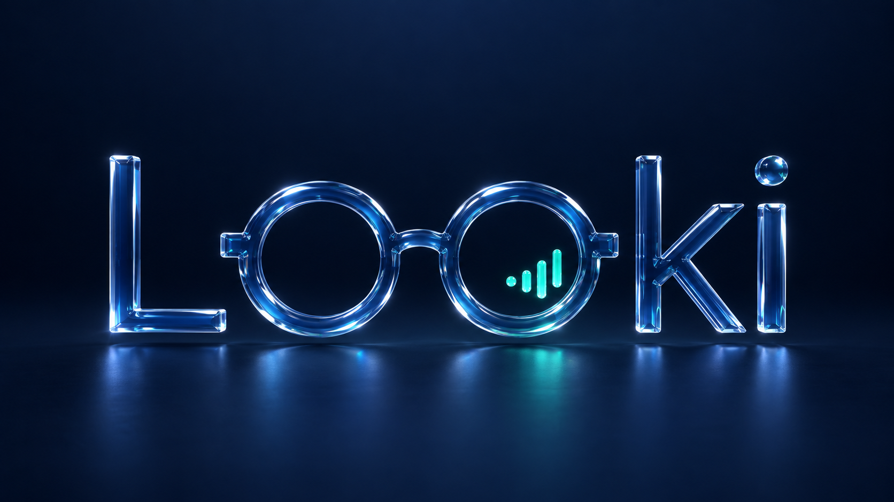

<p align="center">
  
</p>

# LOOKi — site vitrine

Site vitrine du projet **LOOKi** : des lunettes connectées avec assistance vocale en mobilité pour les
personnes malvoyantes, et une continuité d'accompagnement avec les professionnels de la basse vision.
Projet porté par l'équipe Mind7 (EPITA, SIGL 2027). Le projet est en développement : le site ne présente
ni client, ni résultat, ni disponibilité commerciale.

## Démarrer

```bash
npm install
npm run dev      # http://localhost:4321
npm run build    # site statique dans dist/
npm run preview  # sert dist/ localement
npm run check    # vérification TypeScript / Astro
```

Prérequis : Node.js ≥ 22.12.

## Stack

- [Astro 7](https://astro.build) : pages statiques, SEO / Open Graph, images optimisées (WebP redimensionné, dimensions réservées).
- Îlots React + TypeScript uniquement pour l'animation, adaptés de [React Bits](https://reactbits.dev) :
  - `Lightfall` (ogl) : pluie de lumière turquoise du premier écran ;
  - `RippleDistortion` (ogl) : ondulation au pointeur sur le visuel d'accueil et le logo en verre ;
  - `SplitReveal` (motion) : apparition mot à mot du titre et du sous-titre ;
  - `GlassTilt` (motion) : inclinaison douce des visuels au pointeur.
  Tous se désactivent en mouvement réduit, sans WebGL, au tactile ou en économie de données ; l'image ou le texte reste affiché.
- Communiqués de presse en Markdown : voir [COMMUNIQUES.md](COMMUNIQUES.md).
- Polices auto-hébergées : Bricolage Grotesque (titres), Manrope (texte).

## Pages

| Route | Contenu |
|---|---|
| `/` | Accueil : héro, La solution, Au quotidien, constat, Pour les professionnels, Vision, aperçu presse, Contact |
| `/communiques-de-presse/` | Liste des communiqués (état vide élégant tant qu'aucun n'est publié) |
| `/communiques-de-presse/<slug>/` | Page permanente d'un communiqué (résumé, image, PDF, lien permanent) |
| `/404` | Page introuvable |

## Organisation

```
assets/looki-images/      bibliothèque visuelle source + galerie.html (outil de sélection, hors site)
src/
  assets/brand/           logo vectorisé (SVG) d'après 00-logo-original.png
  assets/images/          copies des visuels retenus pour le site
  components/             en-tête, pied de page, formulaire, cartes presse, bulle vocale…
  components/react/       Lightfall, RippleDistortion, SplitReveal, GlassTilt
  content/communiques/    communiqués Markdown (+ _modele.md, ignoré)
  layouts/BaseLayout.astro  <head>, métadonnées, lien d'évitement, apparition au défilement
  lib/site.ts             nom, navigation, configuration du contact
  pages/                  index, communiques-de-presse/, 404
  styles/global.css       système de design (bleu nuit, blanc givré, turquoise)
```

## Direction artistique

Univers « verre liquide » : bleu nuit `#031D3B` / `#061426`, turquoise `#00C9A0`, blanc givré.
Composition éditoriale, titres expressifs, textes courts, alternance de sections sombres et claires,
panneaux translucides utilisés avec parcimonie. Les visuels sont des concepts : le design des lunettes
n'est pas figé et les scènes humaines illustrent des usages, pas des performances.

<p align="center">
  
</p>

## Accessibilité

Navigation clavier complète, lien d'évitement, focus visible, structure sémantique, alternatives
textuelles, images décoratives ignorées par les lecteurs d'écran, `prefers-reduced-motion` respecté,
contrastes AA sur fonds sombres et clairs, rendu complet sans JavaScript.

## À configurer avant la mise en ligne

1. **Domaine** : variable d'environnement `SITE_URL` (ou `site` dans `astro.config.mjs`) pour les balises canonical, Open Graph et les liens permanents des communiqués.
2. **Formulaire de contact** : les demandes arrivent sur **mind7.sigl@outlook.fr** (`site.contact.email`).
   Le site étant statique, il n'a pas de serveur qui envoie l'e-mail : le formulaire prépare le message
   dans la messagerie du visiteur, déjà adressé à cette boîte, objet et corps remplis ; le visiteur
   l'envoie depuis sa messagerie. L'adresse est aussi affichée en clair (contact, pied de page, espace presse),
   donc le lien reste utilisable sans JavaScript.
   *Optionnel* : pour un envoi silencieux, sans quitter la page, créez un compte chez un service de
   formulaire (Formspree, Web3Forms, Netlify Forms…) configuré pour transmettre à cette adresse, puis collez
   l'URL reçue dans `site.contact.endpoint` (`src/lib/site.ts`). Le formulaire bascule automatiquement de mode.
3. **Mentions légales** : à ajouter au pied de page une fois l'entité et l'adresse connues.
4. **Hébergement** : `npm run build` produit un site statique déployable sur n'importe quel hébergeur.
