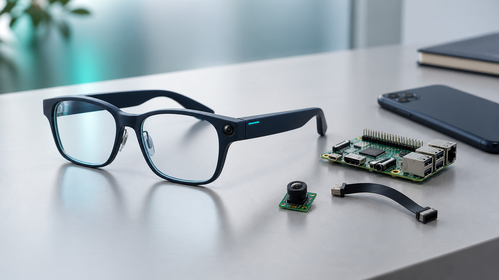

14 septembre 2026 — L’équipe Mind7 annonce le lancement du développement de LOOKi, un projet de lunettes connectées qui associe intelligence artificielle, vision par ordinateur et assistance vocale. Son ambition : donner aux personnes malvoyantes les moyens de se déplacer avec davantage de confiance, tout en renforçant le lien avec les professionnels qui les accompagnent.

Destiné en priorité aux centres de rééducation basse vision, aux structures médico-sociales et aux associations spécialisées, LOOKi place l’innovation au service d’un besoin concret : faire de chaque déplacement une occasion de gagner en autonomie.

## Des technologies de pointe, une expérience simple

Identifier une entrée, retrouver ses repères sur un trajet inconnu ou anticiper un obstacle : LOOKi est conçu pour rendre les informations essentielles de l’environnement accessibles par la voix.

Le développement s’appuie sur une architecture associant une caméra au niveau du regard, des traitements d’intelligence artificielle sur smartphone et des services cloud. La vision par ordinateur analysera les éléments de l’environnement, tandis que la localisation et l’assistance vocale apporteront des indications adaptées au contexte.

Cette combinaison de technologies de pointe poursuit un objectif clair : transmettre la bonne information au bon moment, sans imposer à l’utilisateur de tenir un téléphone pour filmer son parcours. Le format lunettes privilégie la discrétion, la simplicité et une interaction naturelle.

*Composants de développement du prototype. Illustration conceptuelle : ces éléments ne représentent pas le produit final.*

## Une continuité entre le terrain et le centre

L’ambition de LOOKi dépasse l’assistance pendant les déplacements. Le projet intègre le développement d’un tableau de bord destiné aux professionnels, pour mieux comprendre les usages et les difficultés rencontrées entre les séances.

Ces informations aideront les orthoptistes, les ergothérapeutes et les instructeurs en locomotion à personnaliser les parcours d’apprentissage, à identifier les situations à travailler et à enrichir leurs échanges avec les bénéficiaires.

Pour les structures, LOOKi apportera ainsi un lien supplémentaire entre l’accompagnement au centre et l’expérience vécue au quotidien. La technologie prolongera le suivi tout en préservant la place essentielle du professionnel.

## Un développement tourné vers les usages

Cette première phase sera consacrée au prototype, à l’intégration des fonctions essentielles et à leur évaluation. La pertinence des indications vocales, le confort, l’accessibilité et la protection des données guideront les choix de conception.

Les lunettes viendront compléter les aides à la mobilité existantes. Les expérimentations permettront de mesurer leurs performances et de préciser leurs conditions d’utilisation.

Mind7 invite les centres de rééducation, les structures médico-sociales et les associations à échanger avec l’équipe pour contribuer à cette démarche et préparer de futures expérimentations.

## À propos de LOOKi

LOOKi développe une approche de l’assistance connectée centrée sur l’autonomie des personnes malvoyantes et la continuité de leur accompagnement.

Projet IoT réalisé par l’équipe Mind7 — EPITA SIGL 2027.
